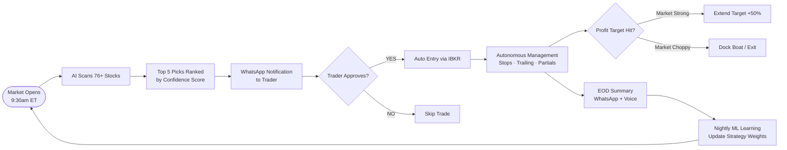
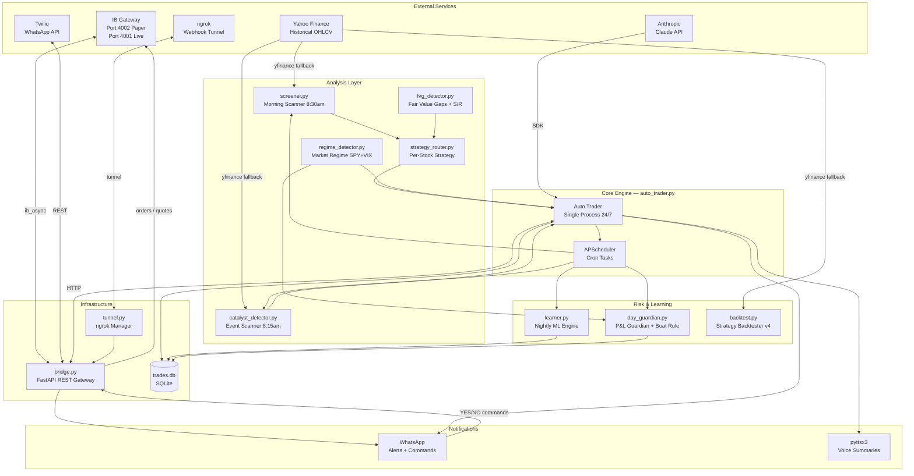
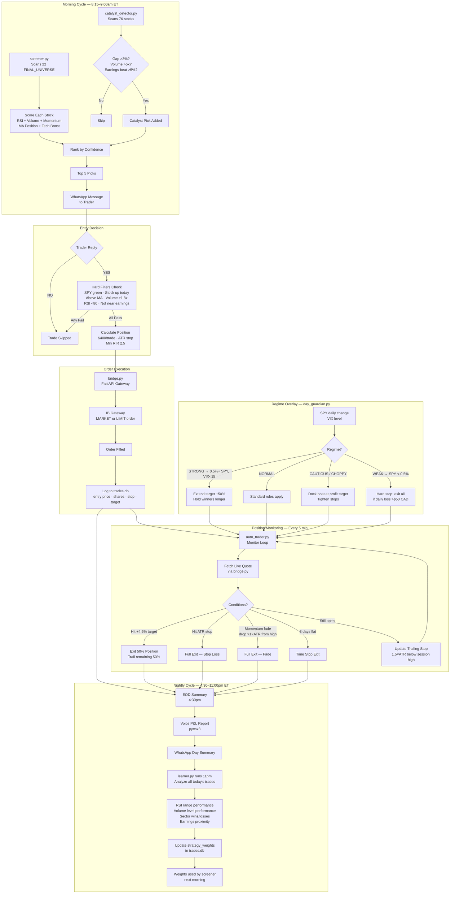
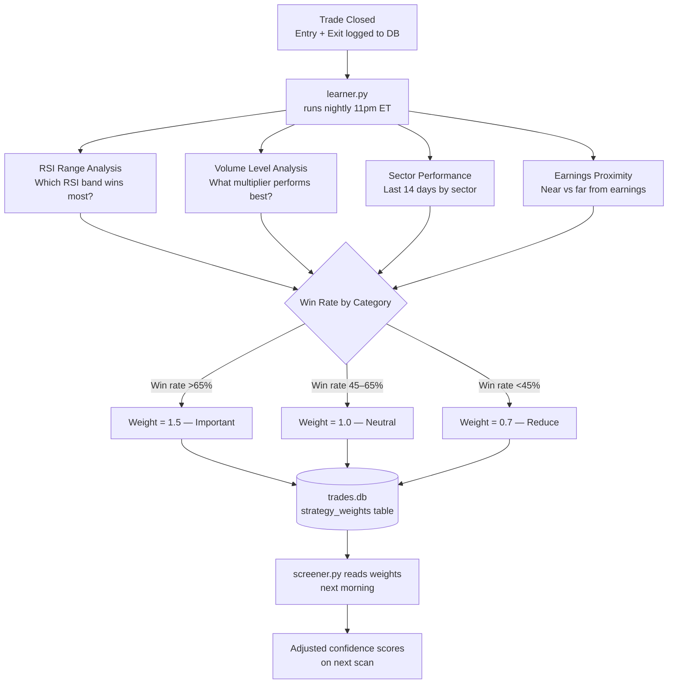

# AI-Powered Swing Trading System

An automated swing trading system built on Interactive Brokers (paper account), combining technical analysis, market regime detection, ML-based strategy optimization, and WhatsApp-based human-in-the-loop execution.

---

## Business Concept

The system acts as an AI trading assistant that does the heavy lifting — scanning, scoring, and monitoring — while the human trader retains final execution authority via WhatsApp. Each morning it surfaces the top 5 trade candidates ranked by confidence. The trader approves or rejects with a simple YES/NO. The system then manages the trade autonomously (stops, trailing, partial exits) and delivers a P&L summary at end of day.



---

## Architecture



---

## Data Flow



---

## Strategy Flow

```mermaid
flowchart LR
    subgraph Universe["Stock Universe"]
        U1[BLUE_CHIPS<br/>13 stocks]
        U2[PROVEN_STOCKS<br/>14 stocks]
        U3[FINAL_UNIVERSE<br/>23 stocks — live trading]
        U4[CATALYST_UNIVERSE<br/>76 stocks — catalyst scan]
    end

    subgraph Router["strategy_router.py"]
        R1{FVG present?}
        R2{Trend above 50MA?}
        R3{Gap-up catalyst?}
        R4{SBS breakout?}

        R1 -- Yes --> S1[FVG_FILL Strategy]
        R2 -- Yes --> S2[TREND_PULLBACK Strategy]
        R3 -- Yes --> S3[GAP_GO Strategy]
        R4 -- Yes --> S4[SBS_BREAKOUT Strategy]
    end

    subgraph Signals["Entry Signals"]
        S1 --> SIG[Confidence Score<br/>0–100]
        S2 --> SIG
        S3 --> SIG
        S4 --> SIG
        SIG --> THRESH{Score ≥75?}
        THRESH -- Yes --> TRADE[Trade Candidate]
        THRESH -- No --> DROP[Filtered Out]
    end

    U3 --> R1 & R2 & R4
    U4 --> R3
```



---

## ML Learning Loop



---

## Scheduling Timeline

```mermaid
gantt
    title Daily Task Schedule (Eastern Time)
    dateFormat HH:mm
    axisFormat %H:%M

    section Pre-Market
    Catalyst Scan (76 stocks)       :a1, 08:15, 15m
    Morning Screen (22 stocks)      :a2, 08:30, 15m
    Voice Summary + WhatsApp        :a3, 09:00, 5m
    MSFT Auto-Buy (Mon only)        :a4, 09:31, 5m

    section Market Hours
    Trade Entry Window              :crit, active, b1, 09:31, 330m
    Position Monitor (every 5 min) :b2, 09:31, 390m
    WhatsApp Poll (every 15 min)   :b3, 09:31, 390m
    Stop-Loss Check (every 30 min) :b4, 09:31, 390m
    Day Guardian P&L Check         :b5, 09:31, 390m

    section Post-Market
    No New Entries After            :milestone, c1, 15:00, 0m
    Market Close                    :milestone, c2, 16:00, 0m
    EOD P&L Summary + Voice        :c3, 16:30, 10m

    section Overnight
    Nightly ML Learning Cycle       :d1, 23:00, 30m
```



---

## Technology Stack

| Layer | Technology | Purpose |
|---|---|---|
| Language | Python 3.11 | Core runtime |
| Broker | IB Gateway (ib_async) | Order execution, live quotes |
| Market Data | yfinance (fallback) | Historical OHLCV, ticker info |
| Technical Analysis | `ta` library | RSI, MAs, ATR, volume indicators |
| Web API | FastAPI + uvicorn | REST gateway for IBKR bridge |
| AI Reasoning | Anthropic Claude SDK | Trade reasoning (experimental) |
| Messaging | Twilio WhatsApp API | Alerts + human-in-the-loop |
| Tunnel | pyngrok (ngrok) | Expose webhook to internet |
| Scheduling | APScheduler | Cron-style task automation |
| Persistence | SQLite3 | Trades, P&L, strategy weights |
| Data Processing | pandas + numpy | OHLCV manipulation, statistics |
| Voice | pyttsx3 | End-of-day spoken summaries |
| Backtesting | `backtesting` library + matplotlib | Historical strategy validation |
| Config | python-dotenv (.env) | API keys, IBKR settings |

---

## Key Configuration

| Parameter | Value | Notes |
|---|---|---|
| Capital per trade | $400 | Fixed position size |
| Max open trades | 50 | Paper testing mode |
| Min risk:reward | 2.5 | Filters low-quality setups |
| Profit target | +4.5% | 50% exit here, trail remainder |
| Stop loss | −3.0% / 1.5×ATR | Whichever is tighter |
| Max RSI entry | 80 | No overbought entries |
| Min volume ratio | 1.8× | Volume confirmation required |
| No entry after | 3:00pm ET | Avoids end-of-day traps |
| Daily loss limit | $50 CAD | Hard stop, exit all positions |
| Daily profit target | $80 CAD | Boat rule trigger threshold |
| IBKR port (paper) | 4002 | Switch to 4001 for live |

---

## Backtesting Results (v4 — 2024–2026)

| Metric | Result |
|---|---|
| Total Trades | 173 |
| Win Rate | 62.4% |
| Average P&L | $3.18/trade |
| Total P&L | $550.09 |
| Best Performer | AAPL (100% win, 4/4) |
| Top Sector | SEMI (73% win rate) |
| Avoid | NVDA (0% — 3 losses), AFRM (42.9%) |

**Focus stocks (top 11 by backtest):** AAPL, CNQ, PLTR, COHR, HOOD, NUTX, LITE, VST, ITA, ORCL, TOST

---

## How to Run

### Prerequisites
- IB Gateway running on port 4002 (paper) or 4001 (live)
- Python 3.11 with all dependencies
- `.env` file configured with API keys

### Start All Services
```bat
start_trading.bat
```

This opens 5 terminals:
1. `python bridge.py` — FastAPI REST gateway
2. `python auto_trader.py` — Core trading engine (absorbs scheduler + trader)
3. `python day_guardian.py` — P&L risk guardian
4. `python tunnel.py` — ngrok WhatsApp webhook
5. _(legacy scheduler/trader — retired, absorbed by auto_trader.py)_

### WhatsApp Commands
| Command | Action |
|---|---|
| `YES` | Approve the latest trade pick |
| `NO` | Reject the latest trade pick |
| `YES ALL` | Approve all pending picks |
| `STATUS` | Get current positions + P&L |
| `CANCEL` | Cancel pending order |

---

## Project Structure

```
c:/trading/
├── auto_trader.py        # Core engine — entry, monitoring, scheduling
├── bridge.py             # FastAPI gateway for IBKR + WhatsApp
├── database.py           # SQLite trade logging + strategy weights
├── screener.py           # Morning stock scanner (8:30am)
├── catalyst_detector.py  # Event/gap-up scanner (8:15am)
├── regime_detector.py    # Market regime (STRONG/NORMAL/WEAK/CHOPPY)
├── fvg_detector.py       # Fair Value Gap + Support/Resistance
├── strategy_router.py    # Per-stock strategy assignment
├── learner.py            # Nightly ML weight updater
├── backtest.py           # Historical strategy backtester (v4)
├── watchlist.py          # Stock universe definitions
├── day_guardian.py       # P&L guardian + "boat rule"
├── tunnel.py             # ngrok tunnel manager
├── trades.db             # SQLite database
├── .env                  # API keys + config
├── start_trading.bat     # Windows multi-terminal launcher
└── logs/                 # Per-process log files
```

---

*Paper trading on Interactive Brokers — Brampton, ON*
