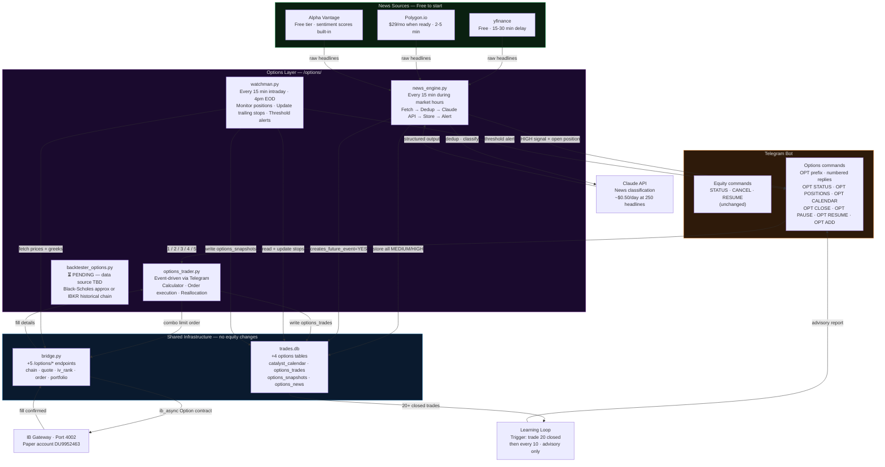
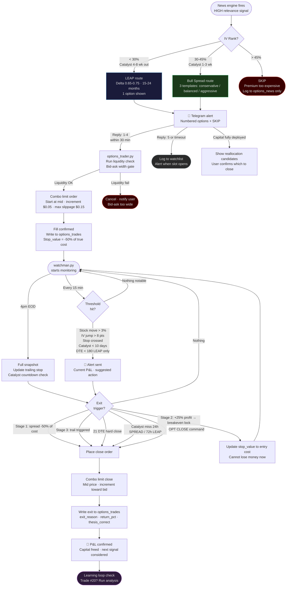
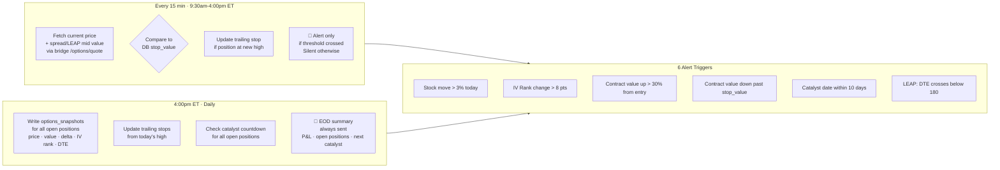

# Options Trading System — Full Design
**Status: LOCKED May 9 2026 — Approved for build**

---

## Folder Structure

```
trading/
  options/
    news_engine.py         ← Phase 3: multi-source news + LLM classifier
    watchman.py            ← Phase 4: position monitor + trailing stops
    options_trader.py      ← Phase 5: calculator + order execution + Telegram
    backtester_options.py  ← Phase 6: pending (data source decision needed)
    docs/
      options_system_design.md  ← this file
```

Shared (zero changes to equity files):
```
  bridge.py       ← Phase 2: add 5 /options/* endpoints
  database.py     ← Phase 1: add 4 options tables
  trades.db       ← shared DB, all new tables additive
```

---

## System Architecture



---

## Trade Lifecycle



---

## Watchman Logic



---

## Database Schema (4 new tables)

```sql
-- Intelligence layer: auto-populated by news_engine + manual DOMAIN_INSIGHT
CREATE TABLE IF NOT EXISTS catalyst_calendar (
    id                  INTEGER PRIMARY KEY AUTOINCREMENT,
    symbol              TEXT NOT NULL,
    catalyst_type       TEXT NOT NULL,   -- EARNINGS/CONFERENCE/PRODUCT_LAUNCH/
                                         -- MACRO_EVENT/SECTOR_EVENT/ANALYST_EVENT/DOMAIN_INSIGHT
    event_name          TEXT,
    event_date          TEXT,
    your_confidence     TEXT,            -- HIGH / MEDIUM / LOW
    expected_move_pct   REAL,
    iv_rank_when_noted  REAL,
    news_source         TEXT,
    notes               TEXT,
    created_date        TEXT
);

-- Position record: entry → hold → exit, full lifecycle
CREATE TABLE IF NOT EXISTS options_trades (
    id                  INTEGER PRIMARY KEY AUTOINCREMENT,
    strategy            TEXT NOT NULL,   -- LEAP / BULL_SPREAD
    symbol              TEXT NOT NULL,
    cap_type            TEXT,            -- LARGE / MID
    underlying_price    REAL,
    strike              REAL,            -- LEAP: single strike
    long_strike         REAL,            -- SPREAD: buy leg
    short_strike        REAL,            -- SPREAD: sell leg
    expiry              TEXT,
    right               TEXT,            -- C / P
    contracts           INTEGER,
    delta_entry         REAL,
    iv_rank_entry       REAL,
    iv_pct_entry        REAL,
    premium_paid        REAL,            -- true cost incl. commission
    max_profit          REAL,
    max_loss            REAL,
    net_debit           REAL,            -- spreads only
    stop_value          REAL,            -- current stop threshold (updated by watchman)
    stop_stage          INTEGER,         -- 1=hard / 2=breakeven / 3=trailing
    catalyst_id         INTEGER REFERENCES catalyst_calendar(id),
    days_to_catalyst    INTEGER,
    entry_grade         TEXT,            -- A+ / A / B / C
    entry_thesis        TEXT,
    entry_date          TEXT,
    exit_date           TEXT,
    exit_value          REAL,
    exit_reason         TEXT,            -- PROFIT_TARGET/HARD_STOP/TRAIL/21DTE/
                                         -- CATALYST_MISS/REALLOCATION/MANUAL
    return_pct          REAL,
    return_on_risk      REAL,
    thesis_correct      TEXT,            -- YES / NO / PARTIAL
    lesson              TEXT,
    status              TEXT DEFAULT 'OPEN'  -- OPEN / CLOSED / ROLLED
);

-- Daily + intraday snapshots: every 15-min threshold check + 4pm EOD
CREATE TABLE IF NOT EXISTS options_snapshots (
    id                  INTEGER PRIMARY KEY AUTOINCREMENT,
    trade_id            INTEGER NOT NULL REFERENCES options_trades(id),
    snapshot_date       TEXT,
    snapshot_time       TEXT,
    underlying_price    REAL,
    contract_value      REAL,
    pnl_unrealized      REAL,
    delta               REAL,
    iv_rank             REAL,
    iv_pct              REAL,
    days_to_expiry      INTEGER,
    stop_value          REAL,            -- what stop was at this snapshot
    notes               TEXT
);

-- Classified news: stored if MEDIUM or HIGH, discarded otherwise
CREATE TABLE IF NOT EXISTS options_news (
    id                  INTEGER PRIMARY KEY AUTOINCREMENT,
    symbol              TEXT NOT NULL,
    headline            TEXT,
    source              TEXT,            -- yfinance / polygon / alpha_vantage
    source_first        INTEGER,         -- 1 if this source reported it first
    published_at        TEXT,
    relevance           TEXT,            -- HIGH / MEDIUM / LOW / NOISE
    news_type           TEXT,            -- PARTNERSHIP/REGULATORY/EARNINGS_SIGNAL/
                                         -- PRODUCT/LAYOFF/MACRO/ANALYST/CEO_COMMENT/LEGAL/SECTOR
    direction           TEXT,            -- BULLISH / BEARISH / NEUTRAL
    time_horizon        TEXT,            -- IMMEDIATE / SHORT / LONG
    already_priced_in   TEXT,            -- YES / NO / UNCLEAR
    creates_future_event INTEGER,        -- 1 if auto-created a catalyst_calendar entry
    catalyst_id         INTEGER REFERENCES catalyst_calendar(id),
    one_line_reason     TEXT,
    linked_trade_id     INTEGER REFERENCES options_trades(id),
    created_at          TEXT
);
```

---

## Telegram Commands

### Options commands (OPT prefix — never conflicts with equity)

```
OPT STATUS              P&L summary of all open positions
OPT POSITIONS           Detailed view: each position + Greeks + stop level + DTE
OPT CALENDAR            Upcoming catalysts next 30 days
OPT PAUSE               Pause news engine alerts (equity unaffected)
OPT RESUME              Resume news engine alerts
OPT CLOSE [symbol]      Manually close a position (shows confirm step)
OPT ADD [sym] [date]    Add manual DOMAIN_INSIGHT catalyst entry
                        e.g. OPT ADD NVDA 2026-11-30 AWS re:Invent keynote HIGH
```

### Alert responses (numbered, context-aware, 30-min timeout)

```
Signal alert:  reply 1 / 2 / 3 / 4 = choose template, or 5 = SKIP
Capital full:  reply 1 = view reallocation candidates, 2 = watchlist, 3 = skip
Reallocation:  reply REALLOCATE or HOLD
Close confirm: reply YES or NO
```

### Equity commands (unchanged)
```
STATUS    CANCEL    RESUME
```

---

## Exit Rules

### Bull Spread

| Stage | Trigger | Action |
|-------|---------|--------|
| 1 — Hard stop | Spread value drops -50% of true cost | Close immediately |
| 2 — Breakeven lock | Spread value reaches +25% profit | Move stop_value to entry cost |
| 3 — Trail | Spread value reaches +50% of max profit | Trail: stop = high - (15% of max profit) |
| Time | 21 DTE | Always close regardless of P&L |
| Catalyst miss | Catalyst passed, stock flat, 24h | Close — IV crush incoming |

### LEAP

| Stage | Trigger | Action |
|-------|---------|--------|
| 1 — Hard stop | Contract down -40% of premium | Close |
| 2 — Breakeven lock | Contract up +30% profit | Move stop_value to entry cost |
| 3 — Trail | Contract up +50% of premium | Trail: stop = high - (20% of premium paid) |
| Roll alert | DTE crosses below 180 | Telegram alert to roll or close |
| Catalyst miss | 72h after event, no move | Review and likely close |

---

## Bid/Ask Execution Rules

```
Entry (combo order — always, never leg separately):
  Start limit at mid price (long_mid - short_mid)
  Increment $0.05 every 45 seconds
  Cancel if slippage exceeds $0.15 from mid (too illiquid)

Exit (combo order):
  Start limit at mid
  Increment $0.05 toward bid every 45 seconds
  Accept fill — getting out cleanly > squeezing last $5

Pre-filter (before generating templates):
  Long leg bid-ask > $0.30  → flag ILLIQUID
  Short leg bid-ask > $0.25 → flag ILLIQUID
  Net debit < $0.80         → skip (commissions eat edge)

Commission per round-trip: ~$3.20-3.60 (2 legs × open + close)
Always use post-commission numbers in EV and R:R calculations
```

---

## Signal Routing (IV Rank decides instrument)

```
Same news signal → different instrument based on IV Rank:

  IV Rank < 30%  + catalyst 4-8 wk  → LEAP preferred
  IV Rank 30-45% + catalyst 1-3 wk  → Bull Spread preferred
  IV Rank > 45%                      → SKIP (premium too expensive)
```

---

## Capital Allocation

```
Options budget:  $3-4K  (separate from equity $10K — never mixed)
Max per LEAP:    $2,200 (RKLB upper bound in mid-cap universe)
Max per spread:  $200   (aggressive template upper bound)
Max positions:   4-5 open simultaneously

Mid-cap LEAP universe (now):    PLTR · RKLB · APP · HOOD · IONQ
Large-cap LEAP universe (later, $8K+): NVDA · META · AMZN · MSFT
Bull spread universe:           all of above + SPY/QQQ (liquid)
Wheel / CSP:                    deferred until $15K+ options capital
```

---

## Learning Loop

```
Frequency:    First run after trade #20 closes
              Then every 10 additional closed trades
              Daily EOD: lightweight stats only (no analysis)

What it analyses:
  Return by grade (A+ vs A vs B vs C)
  Return by IV rank at entry (<25% vs 25-35% vs >35%)
  Return by cap_type (LARGE vs MID)
  Return by catalyst present vs absent
  Exit reason distribution (too many hard stops = entry quality issue)
  News source quality (which source caught the most unique HIGH signals)

Output:       Advisory Telegram report
              No auto-config changes until 50+ trades
              User confirms any threshold adjustments via OPT commands
```

---

## Backtesting — Design Pending

Options backtesting requires historical options chain data (IV, bid/ask, greeks per timestamp).

| Approach | Data | Cost | Accuracy |
|----------|------|------|----------|
| IBKR historical bars + Black-Scholes approx | Stock price + VIX as IV proxy | Free | ~70% |
| OptionsDX | Full chain history | ~$50/mo | High |
| IBKR reqHistoricalData on Option contract | Real chain snapshots, limited lookback | Free (capped) | High for recent |

**Decision needed before building `backtester_options.py`:**
- Confirm acceptable accuracy level (Black-Scholes approx vs real chain data)
- Confirm lookback period needed (1 year vs 3 year)
- Start with IBKR free historical + B-S approx, upgrade data if backtests show promise

**`backtester_options.py` is Phase 6 — after Phase 1-5 are built and paper trading is running.**

---

## Build Order

```
Phase 1 — database.py        Add 4 tables (IF NOT EXISTS, zero equity risk)
Phase 2 — bridge.py          Add 5 /options/* endpoints (additive)
Phase 3 — news_engine.py     Multi-source + dedup + Claude API + alerts (most complex)
Phase 4 — watchman.py        15-min scan + EOD + trailing stops + threshold alerts
Phase 5 — options_trader.py  Calculator + order execution + Telegram commands
Phase 6 — backtester_options.py  (pending data source decision)
```

---

*Design locked May 9 2026. Approved for build.*
